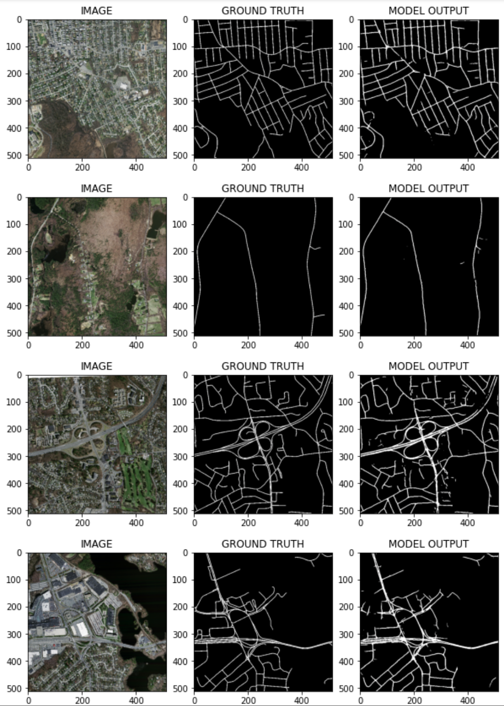

# Semantic Segmentation of Aerial Images

## **About**

> Semantic segmentation, with the goal to assign semantic labels to every pixel in an image, is an essential computer vision task. In this project, we use semantic segmentation models to extract roads from satellite images.
* Create custom datasets, dataloaders and transformers for semantic segmentation tasks.
* Build semantic segmentation models to classify an image at the pixel level. Implement performance metrics to keep tracking the training process.
* Test the model using aerial images of other cities.

## **Dataset**
The dataset for this project is the subset(200 images and its masks) of the original dataset (Massachusetts Roads Dataset) consisting of 1171 aerial images of the state of Massachusetts. Each image is 1500×1500 pixels in size, covering an area of 2.25 square kilometers. Using the helper.py and train.csv, the data is extracted from the original dataset.

## **Result**

